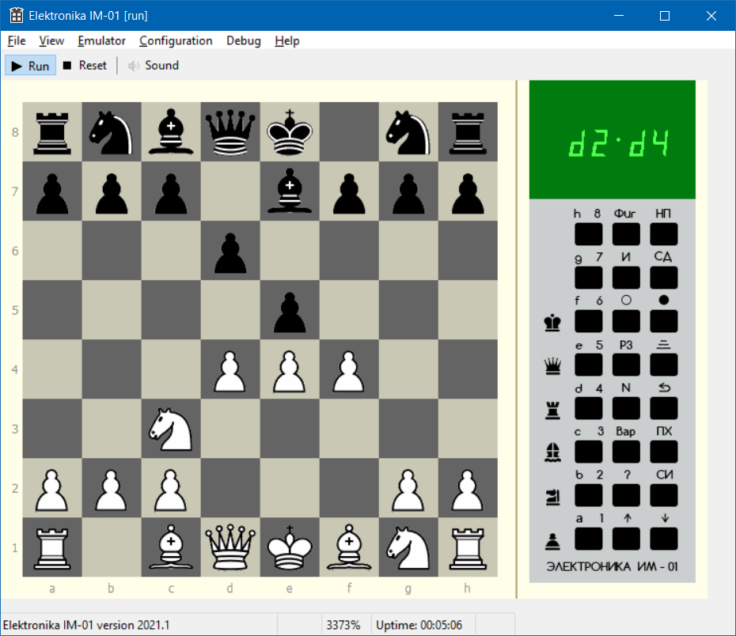

# elektronika-im01 - emulator of soviet chess computer

This project aim is to emulate soviet chess computers "Электроника ИМ-01", "Электроника ИМ-01Т" and "Электроника ИМ-05".

## На русском

Данный проект имеет целью эмуляцию советских шахматных компьютеров "Электроника ИМ-01", "Электроника ИМ-01Т" и "Электроника ИМ-05".
Проект основан на коде эмулятора BKBTL.

Образы ПЗУ для ИМ-01/ИМ-01Т считал и предоставил Егор Лосев (Radon17). 
Образы ПЗУ для ИМ-05 считал и предоставил Леонид Ядренников (RCgoff).

Состояние проекта: Work in Progress 🚧

## Ссылки
* [Elektronika IM-01](http://www.leninburg.com/museum/show_calc.php?n=299&lang=1&test=0) в коллекции Сергея Фролова
* [Электроника ИМ-01](http://www.emuverse.ru/wiki/%D0%AD%D0%BB%D0%B5%D0%BA%D1%82%D1%80%D0%BE%D0%BD%D0%B8%D0%BA%D0%B0_%D0%98%D0%9C-01) в Emuverse — технические подробности

## См. также
* [intellekt02](https://github.com/nzeemin/intellekt02/) — эмулятор игрового устройства "Интеллект-02", с картриджем "Шахматы"
